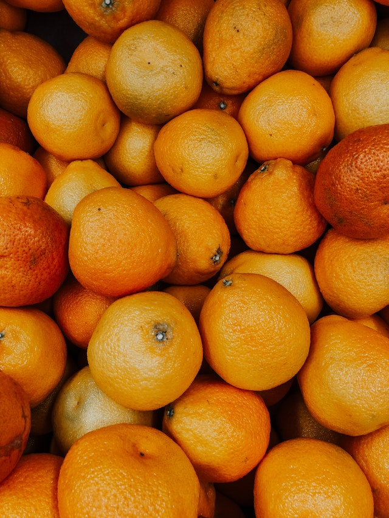

Creates a photo mosaic with the given image. In other words, outputs a photo made of smaller, tinted versions of the same photo.

Example:
input

output
[output-oranges](./images/output-oranges.png)
